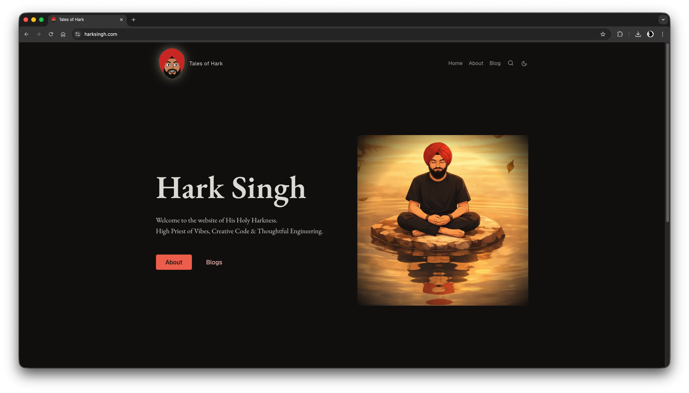
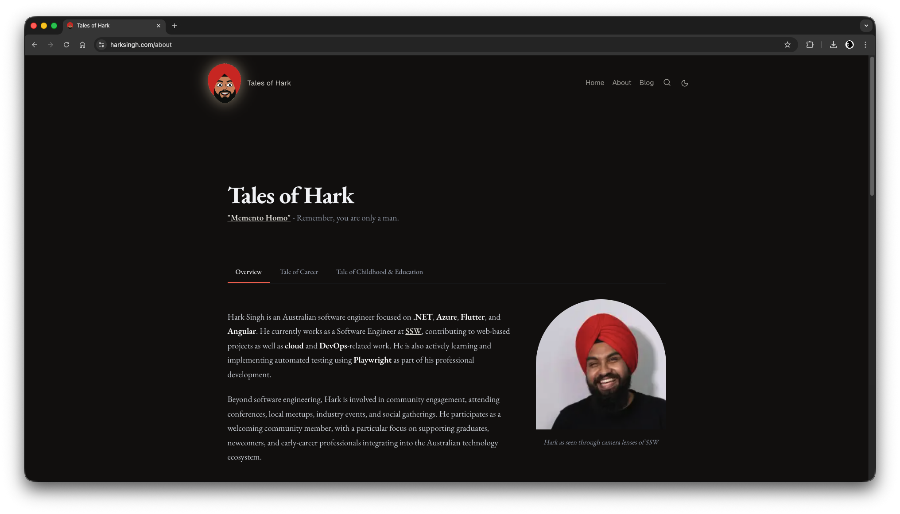
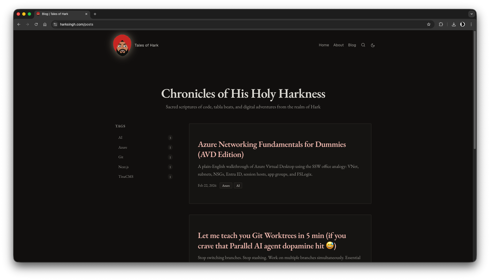
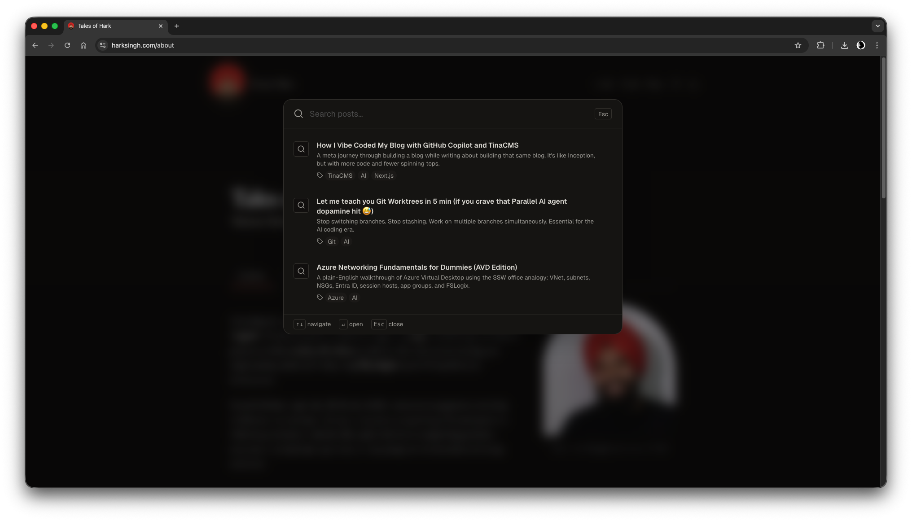

# Tales of Hark

Personal website and blog for Hark Singh — built with Next.js, TinaCMS, and Tailwind CSS. Deployed on Vercel.

Mostly vibe coded with [OpenCode](https://opencode.ai) and Claude Sonnet. Content is all Markdown backed by TinaCMS, and custom components are vibe coded too — surprisingly easy to maintain.

> Live site: [harksingh.com](https://harksingh.com)



| About | Blog | Search |
|---|---|---|
|  |  |  |

---

## Tech stack

| Concern | Choice |
|---|---|
| Framework | Next.js 15 (App Router) |
| Language | TypeScript (strict) |
| CMS | TinaCMS 2.x |
| Styling | Tailwind CSS v4 + shadcn/ui |
| Animation | Motion (Framer Motion v12) |
| Syntax highlighting | Shiki |
| Diagrams | Mermaid |
| Feeds | RSS 2.0 / Atom / JSON Feed |
| Package manager | pnpm |
| Node version | v22 (`.nvmrc`) |
| Lint / format | Biome |

---

## Project structure

```
├── app/                  App Router pages and API routes
│   ├── page.tsx          Home page
│   ├── [...urlSegments]/ Catch-all for CMS-backed pages (e.g. /about)
│   ├── posts/            Blog index and individual post pages
│   ├── feed.xml/         RSS 2.0 feed
│   ├── atom.xml/         Atom feed
│   ├── feed.json/        JSON Feed
│   └── search-index.json/Client-side search index API
├── components/
│   ├── blocks/           Page block components (hero, features, about, video, …)
│   ├── layout/           Header, footer, nav, section wrapper
│   ├── ui/               Shared UI: search modal, video dialog, theme toggle, logo
│   └── mdx-components.tsx Custom TinaMarkdown renderers
├── content/              CMS content files (Markdown / JSON)
│   ├── pages/            home.mdx, about.mdx
│   ├── posts/            Blog post MDX files
│   ├── tags/             Tag MDX files
│   ├── authors/          Author Markdown files
│   └── global/index.json Site-wide header, footer, and theme settings
├── tina/                 TinaCMS schema, collections, and generated types
├── lib/                  Utility functions (cn, feed config)
├── public/               Static assets, Tina admin build, media uploads
└── docs/                 Developer documentation
```

---

## Pages and routes

| Route | Description |
|---|---|
| `/` | Home — hero block + latest 3 posts |
| `/about` | About — tabbed profile, career, photo gallery |
| `/posts` | Blog index — "Chronicles of His Holy Harkness" with tag filtering |
| `/posts/<slug>` | Individual blog post with OG metadata |
| `/admin` | TinaCMS visual editing interface |
| `/feed.xml` | RSS 2.0 feed |
| `/atom.xml` | Atom feed |
| `/feed.json` | JSON Feed |
| `/search-index.json` | Search index (consumed by the client-side search modal) |

---

## Features

- **Block-based pages** — the home and about pages are built from a visual block system editable in TinaCMS (`hero`, `features`, `stats`, `cta`, `callout`, `testimonial`, `video`, `content`, `about`).
- **Blog** — tag filtering, per-post OG image, reading-friendly typography, TinaMarkdown body with custom components.
- **Search** — client-side full-text search (title, excerpt, tags) loaded lazily on first open. Keyboard shortcut: `Cmd/Ctrl + K`.
- **Theme** — system-aware light/dark mode via `next-themes`. Toggle shortcut: `Cmd/Ctrl + ;`.
- **Mermaid diagrams** — fenced code blocks with `lang="mermaid"` render as live diagrams.
- **Video** — react-player embeds in posts and pages; a global video dialog for modal playback.
- **RSS / Atom / JSON feeds** — three feed formats, auto-discovered via `<link rel="alternate">` in the `<head>`.
- **Animated logo** — SVG eyes that track the cursor, with a dark-mode aura.
- **ISR** — pages revalidate every 5 minutes; feeds every hour; global layout every minute.

---

## Local development

### 1. Install dependencies

```bash
pnpm install
```

### 2. Set up environment variables

Copy `.env.example` to `.env` and fill in your TinaCloud credentials:

```bash
cp .env.example .env
```

| Variable | Description |
|---|---|
| `NEXT_PUBLIC_TINA_CLIENT_ID` | TinaCloud project client ID |
| `TINA_TOKEN` | TinaCloud read/write token |
| `NEXT_PUBLIC_TINA_BRANCH` | Branch for TinaCMS to read from (optional) |
| `NEXT_PUBLIC_SITE_URL` | Primary domain for RSS feeds (defaults to `https://harksingh.com`) |

Get your client ID and token from [app.tina.io](https://app.tina.io).

### 3. Run the dev server

```bash
pnpm dev
```

This starts the TinaCMS local GraphQL server alongside Next.js on port **3001**.

| URL | Purpose |
|---|---|
| `http://localhost:3001` | Site |
| `http://localhost:3001/admin` | TinaCMS visual editor |
| `http://localhost:4001/altair/` | GraphQL playground |

---

## Common commands

```bash
pnpm dev              # Development server (Tina + Next.js, port 3001)
pnpm build            # Production build (requires TinaCloud credentials)
pnpm build-local      # Build without TinaCloud (for local/offline CI)
pnpm start            # Production server (port 3001)
pnpm lint             # Lint with Biome
pnpm exec biome format --write .   # Format with Biome
pnpm exec tsc --noEmit             # Type-check
pnpm exec tinacms codegen          # Regenerate Tina types after schema changes
```

---

## CMS collections

| Collection | Path | Description |
|---|---|---|
| `page` | `content/pages/` | Visual block-builder pages |
| `post` | `content/posts/` | Blog posts with hero image, tags, rich-text body |
| `author` | `content/authors/` | Author profiles |
| `tag` | `content/tags/` | Tags referenced by posts |
| `global` | `content/global/index.json` | Site-wide header, footer, and theme config |

---

## CI

| Workflow | Trigger | What it does |
|---|---|---|
| `pr-open.yml` | PR opened / updated | Runs `pnpm install` + `pnpm build` with TinaCloud credentials |
| `update-dependabot-pr.yml` | Push to `dependabot/npm_and_yarn/**` | Runs `pnpm update tinacms@latest @tinacms/cli@latest` + `pnpm tinacms audit` and commits the result back |

Dependabot is configured to check for TinaCMS package updates daily.

---

## Deployment

The site is deployed on **Vercel**. Vercel automatically sets `NEXT_PUBLIC_VERCEL_GIT_COMMIT_REF`, which TinaCMS uses to determine the content branch for preview deployments.

To deploy your own instance:

1. Import the repository in Vercel.
2. Add `NEXT_PUBLIC_TINA_CLIENT_ID` and `TINA_TOKEN` as environment variables.
3. Vercel handles the rest — `pnpm build` is the build command, `out` is not needed (SSR).

---

## License

Licensed under the [Apache 2.0 License](./LICENSE).
